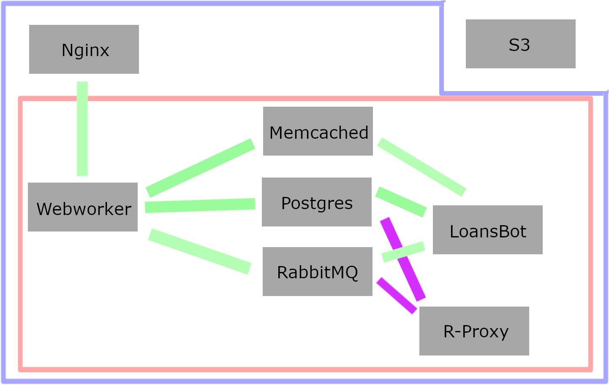

# LoansBot Infrastructure

This repository describes and visualizes how the infrastructure for the
LoansBot and related services is setup.

## Main Components

The LoansBot is mainly comprised of two components - a script which polls
reddit for new comments on a select list of subreddits, and a website. As with
nearly any non-peer-to-peer application, the main value from these services is
the centralized data store.

## Visualization

Summary: Within the blue box is one VPC with two subnets. One of the subnets
is fully public (i.e., connections are allowed in/out) and contains just the
Nginx server. The other subnet is everything in the pink box, and connects
to a NAT Gateway rather than directly communicating with the outside world,
and hence is e-gress only. Two services are connected by a line if they
communicate.

## Services

### Data Stores

There are four services which hold non-transient data (i.e., anything beyond
variables used temporarily for a particulars computation). Only S3 is purchased
as a managed service - i.e., where both the operation and infrastructure are
handled by a third-party (Amazon). For the other data stores, we purchase the infrastructure from Amazon but handle the operation ourselves.

- The Postgres server. This contains the "ground truth" data which is fully
  persistent. Everything you typically thing of as the LoansBot remembering
  is here - who lent who what, how to respond to messages, etc. This is the
  only data store that is backed up regularly to S3, since it's the only data
  store which cannot be trivially regenerated. This currently also stores the
  recent logs, hence every custom-built service connects to it for logging as
  well.
- The memcached server. This contains short-term regeneratable information for
  each of the services. Everything in this store is susceptible to being lost
  at any time, at which point it is simply regenerated if needed again. This
  is used, for example, to store how much karma a user had when we last checked
  reddit 3 minutes ago.
- The RabbitMQ server. As a message queue, this facilitates the transfer of
  requests between services. The main queues are for making requests to reddit
  through the reddit-proxy and receiving the responses from those requests.
  Services communicating through queues is much easier to reason about than
  raw sockets since there are many fewer control flows with queues compared
  to raw sockets. Furthermore, going through rabbit mq allows for a large body
  of metrics (throughput, number in queue, etc) that would not otherwise be
  simple to get.
- The S3 bucket. Backups are stored here, and large assets such as images
  or videos are served from here.

### Other Pre-Built Services

The Nginx server is used as a reverse proxy from raw requests for api endpoints
to our fleet of web workers. This makes horizontal scaling the webworkers, if
necessary, easy in the future. Furthermore, the Nginx handles buffering slow
connections which would otherwise prevent other requests from being served.
Finally, Nginx is the only unmanaged service which is open to the internet
(and hence all the related security implications such as port testing).

### Custom-Built Services

The custom-built services are, as implied by the name, where the loansbot
service becomes really the LoansBot and not GenericTool35.

#### Reddit Proxy

The [reddit proxy](https://github.com/LoansBot/reddit-proxy) handles the
work of actually servicing requests to reddit (authentication, retries, delays,
and converting from reddit responses into the format our application expects).
It only connects with the Postgres database for logging.

#### Webworker

The API endpoints are served using [FastAPI](https://fastapi.tiangolo.com/).
These workers are responsible for servicing every non-static request that is
sent through the web interface. For example, when you view a listing of loans,
these are the workers that converted your request into SQL queries, sent them
to the Postgres database to be executed, then encoded the response in a web-
friendly way.

The web worker is the most complex custom-built application: there are many
types of web-requests which need to be handled in a variety of ways.
Fortunately the available tooling does a great job of reducing how complicated
the web worker is.

At times these workers need to make reddit requests, such as sending pm's to
users to confirm they own the reddit account. These requests are routed through
the message queue to the reddit proxy.

Delayed jobs are avoided where possible in favor of blocking requests, but if
unavoidable they either use dead letter exchanges on RabbitMQ or go through a
specialized table for the job on Postgres.

#### LoansBot

The LoansBot is responsible for polling reddit for new comments and links, then
responding to those comments. The two most complex operations are parsing the
requests and formatting responses, whereas the actual database manipulations
are relatively simple.

The LoansBot is multi-processed and also currently acts a background job worker
for the web when necessary right now. Depending on the queue either dead
lettering is used to delay jobs or a specialized table. This part of the
LoansBot is expected to be broken off if it ever becomes complicated, but for
now the number of these delayed jobs does not warrant the complexity of another
service (and ensuring it is properly connected to the data stores).
